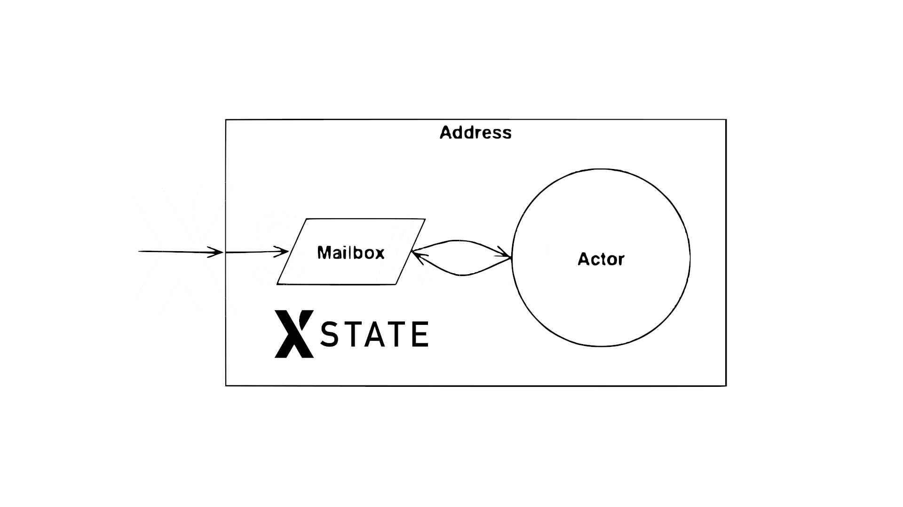
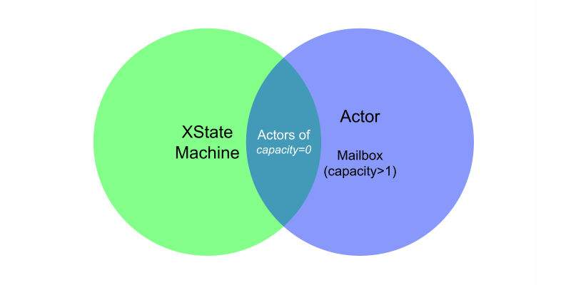
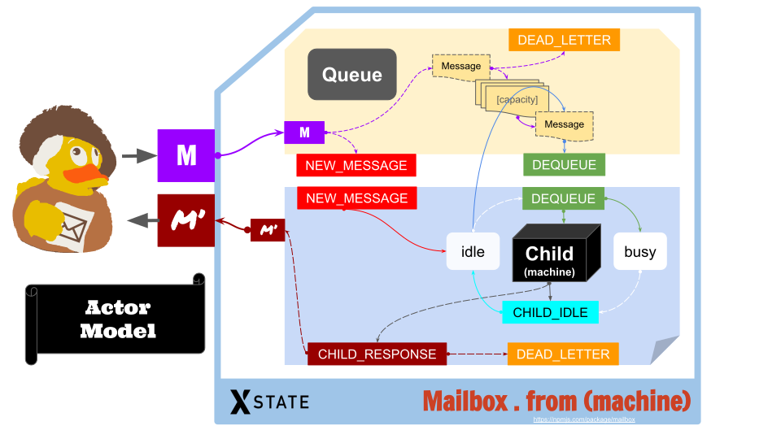
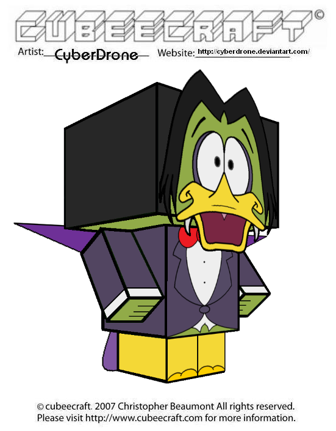
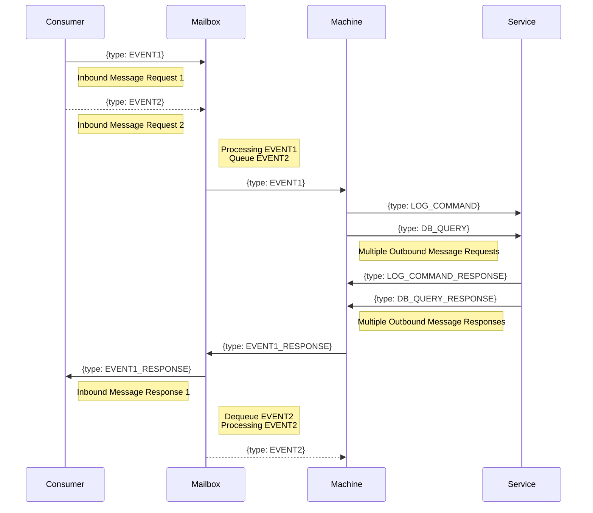
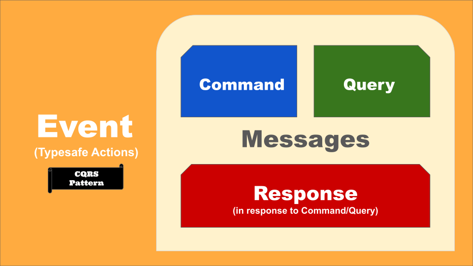

# Mailbox (turns XState Machine into a REAL Actor)

[](https://www.npmjs.com/package/mailbox)
[](https://github.com/huan/mailbox/actions?query=workflow%3ANPM)
[](https://www.typescriptlang.org/)
[](https://github.com/Chatie/tsconfig/issues/16)
[](https://github.com/huan/ducks#3-ducksify-extension-currying--ducksify-interface)

Mailbox is an NPM module built on top of the XState machine, by adding a message queue to the XState machine and letting the machine decide when to process the next message.



> Mailboxes are one of the fundamental parts of the actor model. Through the mailbox mechanism, actors can decouple the reception of a message from its elaboration.
> 
> 1. An actor is an object that carries out its actions in response to communications it receives.
> 1. A mailbox is nothing more than the data structure that holds messages.
> 
> &mdash; <https://www.baeldung.com/scala/typed-mailboxes>

> if you send 3 messages to the same actor, it will just execute one at a time.  
> &mdash; [The actor model in 10 minutes - Actors have mailboxes](https://www.brianstorti.com/the-actor-model/)

The design of Mailbox is very like the the Akka Actor Model:

- [Introduction to Akka Actor Model](https://tech401.com/2018/05/31/2018/2018-05-31-introduction_to_akka_model/)

## Features

- Build on top of the powerful Finite State Machine (FSM) with [XState](https://xstate.js.org/docs/guides/introduction-to-state-machines-and-statecharts/) library.
- Implemented Mailbox pattern for [Actor Model](https://en.wikipedia.org/wiki/Actor_model): process one message at a time, with a message queue
- [Typed Inject](https://github.com/nicojs/typed-inject) native support: `dispose()` method to dispose the mailbox
- Address has been abstracted by a `Address` class for actors
- Unit tests covered

## Voice of Developers

> This project raises an interesting tension between statecharts and actors. By default, statecharts process events immediately while actors (by means of message queues) give you granular control of when to process the next event. ([link](https://twitter.com/chrisshank23/status/1510786425276416004))  
> &mdash; [@chrisshank23](https://twitter.com/chrisshank23), core member of StateML

## TODO

- [ ] Address supports remote actor

## Motivation

I'm building assistant chatbot for Wechaty community, and I want to use actor model based on XState to implement it.

My actor will receive message from Wechaty, and send message to Wechaty.

However, ... (describe the async & multi-user scanerio for the conversation turns)

It turns out ... (describe that we need to make sure the incoming messages are queued when we not finished processing the last one)

> Thread-safe code only manipulates shared data structures in a manner that ensures that all threads behave properly and fulfill their design specifications without unintended interaction.

- [Wikipedia: Thread Safety](https://en.wikipedia.org/wiki/Thread_safety)

## The Problem

A naive state machine is a mailbox actor with `capacity=0`, which means it will face the `Dead Letter` problem when new messages come but it has not finished processing the last one.



Assume we are a coffee maker, and we need 4 three steps to make a coffee:

1. received a `MAKE_ME_COFFEE` event from a customer (sync)
1. get a cup (async: cost some time)
1. fill coffee into the cup (async: cost some time)
1. send a `COFFEE` event to the customer (sync)

The coffee maker can only make one cup of coffee at a time, which means that we can not process the `MAKE_ME_COFFEE` event until we have finished the last one.

The state machine of the coffee maker is:

[](https://stately.ai/viz/5bd10d92-3d39-49b5-ad0d-13a8a0a43891)

Here's the source code of coffee maker:

```ts
const machine = createMachine({
  context: {
    customer: null,
  },
  initial: states.idle,
  states: {
    [states.idle]: {
      entry: Mailbox.actions.idle('coffee-maker')('idle'),
      on: {
        [types.MAKE_ME_COFFEE]: {
          target: states.making,
          actions: actions.assign((_, e) => ({ customer: e.customer })),
        },
        '*': states.idle,
      },
    },
    [states.making]: {
      after: {
        10: states.delivering,
      },
    },
    [states.delivering]: {
      entry: Mailbox.actions.reply(ctx => Events.COFFEE(ctx.customer || 'NO CUSTOMER')),
      after: {
        10: states.idle,
      },
      exit: actions.assign({ customer: _ => null }),
    },
  },
})
```

If there's a new customer come in, and he/she want coffee, we can get a cup then fill coffee to the cup then deliver a cup of coffee to our customer. Everything is fine so far so good.

However, when there are two customer coming in together, and they talk to us at the same time and each customer want a cup of coffee. After we received the first request(event/message), we are starting to get cup and can not listen to another request anymore, which will result an event (the second one) lost (a Dead Letter).

## The Solution

An actor should read the messages to process from its mailbox. A mailbox is an event proxy that holds messages and deals with the backpressure. When the actor have finished processing the current event, it will receive(pull) the next event from the mailbox.

[Mailbox](https://www.npmjs.com/package/mailbox) for rescue.

Mailbox is a NPM module written in TypeScript based on the XState finite state machine to strict follow the actor model's principle:

```ts
const mailbox = Mailboxe.from(machine)
```

Then use `mailbox` instead.

## Mailbox Actor Architecture Diagram



> Image credit: Goeth Rubber Duck, @Lanco, <https://ducksinthewindow.com/goeth-rubber-duck/>  
> SVG image generated by <https://www.visioncortex.org/>

Learn more about similiar (i.e. Akka) Actor & Mailbox diagram with discussion from this Issue: [statelyai/xstate#2870](https://github.com/statelyai/xstate/issues/2870#issuecomment-1002346225)

## Quick Start

1. `import * as Mailbox from 'mailbox'`
1. Add `Mailbox.actions.idle('child-id')('data')` to the `entry` of state of your machine which it accepting new messages, to let the Mailbox continue sending new messages from other actors.
1. Use `Mailbox.actions.reply('YOUR_EVENT')` to reply event messages to other actors.
1. Use `const mailbox = Mailbox.from(yourMachine)` to wrap your actor with mailbox address. The mailbox address is a parent XState machine which will invok your machine as child and add message queue to the child machine.

```ts
import * as Mailbox       from 'mailbox'
import { createMachine }  from 'xstate'

const machine = createMachine({
  initial: 'idle',
  states: {
    idle: {
      /**
       * RULE #1: machine must has `Mailbox.Actions.idle('child-id')` tinbouond-outbound.spec
      entry: Mailbox.actions.idle('child-machine-name')('idle'),
      on: {
        '*': {
          /**
           * RULE #2: machine must use an external transision to the `idle` state when it finished processing any messages, to trigger the `entry` action.
           */
          target: 'idle',
          actions: actions.log('make sure the idle state will be re-entry with external trainsition when receiving event'),
        },
        BUSY: 'busy',
      },
    },
    busy: {
      /**
       * RULE #3: machine use `Mailbox.Actions.reply(EVENT)` to reply EVENT to other actors.
       */
      entry: Mailbox.actions.reply('YOUR_EVENT'),
      after: {
        10: 'idle',
      },
    },
  },
})

const mailbox = Mailbox.from(yourMachine)
// just use it as a standard XState machine
```

You can run a full version at [examples/mailbox-demo.ts](examples/mailbox-demo.ts) and see the result:

```sh
$ ./mailbox-demo.ts 
# testing raw machine ...
sending TASK
TASK_RECEIVED
sending TASK
# testing raw machine ... done

# testing mailbox-ed machine ...
sending TASK
TASK_RECEIVED
sending TASK
TASK_RECEIVED
# testing mailbox-ed machine ... done
```

## Duckula Specification

The `Duckula` is like [Duck](https://github.com/huan/ducks#3-ducksify-extension-currying--ducksify-interface) for Mailbox Actors.



> Image credit: [Papercraft Count Duckula](https://www.deviantart.com/cyberdrone/art/Cubeecraft-Count-Duckula-409375145)

The specification has rules that a Mailbox Actor module:

1. MUST export a `id` of type `string`
1. MUST export a `machine` of type XState machine
1. MUST export a `initialContext` of type `function`, with the `Context` typing, which is the initial context of the machine
1. MUST export a `Event` of type map of `function` which is event creators
1. MUST export a `Type` of type map of `string` which is event types, values in the form `npm-module-or-app/EVENT_TYPE`
1. MUST export a `State` of type map of `string` which is states, values in the form `npm-module-or-app/StateName`
1. MUST be `UPPER_SNAKE_CASE` for the keys of `Event` and `Type`
1. MUST be `UpperCamelCase` for the keys of `State`

> Similiar ideas: [Duckula for Clojure](https://github.com/nomnom-insights/nomnom.duckula)

### Duckula Interface

```ts
interface Duckula <...> {
  id: TID
  Type: TType
  Event: TEvent
  State: TState
  machine: TMachine
  initialContext: () => TContext
}
```

Read the source code at [src/duckula/duckula.ts](https://github.com/huan/mailbox/blob/main/src/duckula/duckula.ts)

### Duckula Examples

1. Ding Dong Machine: <https://github.com/huan/mailbox/blob/main/tests/machine-behaviors/ding-dong-machine.ts>
1. Coffee Maker Machine: <https://github.com/huan/mailbox/blob/main/tests/machine-behaviors/coffee-maker-machine.ts>
1. Baby Machine: <https://github.com/huan/mailbox/blob/main/tests/machine-behaviors/baby-machine.ts>

## References

```ts
import * as Mailbox from 'mailbox'
```

### 1. `Mailbox`

#### 1.1 `Mailbox.from()`

```ts
const mailbox = Mailbox.from(machine, options)
```

Options:

```ts
interface Options {
  id?       : string
  capacity? : number
  logger?   : InterpreterOptions['logger'],
  devTools? : InterpreterOptions['devTools'],
}
```

#### 1.2 `mailbox.address()`

#### 1.3 `mailbox.send()`

#### 1.4 `mailbox.on()`

#### 1.5 `mailbox.open()`

#### 1.6 `mailbox.close()`

### 2. `Mailbox.Address`

#### 2.1. `address.send()`

#### 2.2. `address.condNotOrigin()`

### 3. `Mailbox.actions.*`

#### 3.1. `Mailbox.actions.idle()`

#### 3.2. `Mailbox.actions.reply()`

#### 3.3. `Mailbox.actions.proxyToChild()`

### 4. `Mailbox.nil.*`

#### 4.1 `Mailbox.nil.mailbox`

#### 4.2 `Mailbox.nil.address`

#### 4.3 `Mailbox.nil.logger`

#### 4.4 `Mailbox.nil.machine`

### 5. `Mailbox.helper.*`

#### 5.1 `Mailbox.helper.validate()`

#### 5.2 `Mailbox.helper.wrap()`

## Actor Inbound & Outbound Communication

The mailbox actor will queue the second inbound messages to the child machine, and will not pass it to the child machine until the first inbound message is processed.

However, this are cases that the child machine that needs to communicate with other actors, and receives response messages from other actors.

For outbound messages, the machine internally can send messages to other actors, and receives outbound response messages from other actors without the inbound limitation (the response of the outbound message will be passed by the mailbox queue directly).

The machine internal address will be used to send messages to other actors, and receive messages with this address will by pass the Mailbox queue, for supporting multiple outbound message communication.



> Caution: be aware of the dead lock if your have two actors call each other in the same machine.

## Actor Mailbox Concept

Actors have mailboxes.

> In the actor model, we must follow that: "if you send 3 messages to the same actor, it will just execute one at a time."
>
> It’s important to understand that, although multiple actors can run at the same time, an actor will process a given message sequentially. This means that if you send 3 messages to the same actor, it will just execute one at a time. To have these 3 messages being executed concurrently, you need to create 3 actors and send one message each.
>
> Messages are sent asynchronously to an actor, that needs to store them somewhere while it’s processing another message. The mailbox is the place where these messages are stored.
>
> &mdash; [The actor model in 10 minutes](https://www.brianstorti.com/the-actor-model/)

> an actor is started it will keep running, processing messages from its inbox and won’t stop unless you stop it. It will maintain its state throughout and only the actor has access to this state. This is unlike your traditional asynchronous programming, such as using Future in Scala or promises in javascript where once the call has finished its state between calls is not maintained and the call has finished.
>
> Once an actor receives a message, it adds the message to its mailbox. You can think of the mailbox as queue where the actor picks up the next message it needs to process. Actors process one message at a time. The actor patterns specification does say that the order of messages received is not guaranteed, but different implementations of the actor pattern do offer choices on mailbox type which do offer options on how messages received are prioritized for processing.
>
> &mdash; [Introduction to the Actor Model](https://www.softinio.com/post/introduction-to-the-actor-model/)

## Usage

### XState Machine

1. The `Mailbox.actions.idle('machine-name')('reason')` action must be put inside the `entry` action of when it's ready to receive message (in `states.idle` for example)
1. All events that received in `states.idle` must make a `external` trancition by adding a `target` entry, so that the `states.idle` state will be entered again, which will emit the `Mailbox.actions.idle('machine-name')('reason')` to parent (Mailbox) to let the Mailbox know the machine is ready to receive the next message.

Learn more from [validate.ts source code](validate.ts)

### Dead Letter

Whenever a message fails to be written into an actor mailbox, the actor system redirects it to a synthetic actor called /deadLetters. The delivery guarantees of dead letter messages are the same as any other message in the system. So, it’s better not to trust so much in such messages. The main purpose of dead letters is debugging.

```ts
mailbox.onEvent(event => {
  if (event.type === Mailbox.types.DEAD_LETTER) {
    console.error('DEAD_LETTER:', event.payload)
  }
})  
```

Related reading:

- [Proto.Actor - Dead Letters](https://proto.actor/docs/deadletter/)

### Bounded vs. Unbounded

The mailbox is unbounded by default, which means it doesn’t reject any delivered message. Besides, there’s no back pressure mechanism implemented in the actor system. Hence, if the number of incoming messages is far bigger than the actor’s execution pace, the system will quickly run out of memory.

As we said, unbounded mailboxes grow indefinitely, consuming all the available memory if the messages’ producers are far quicker than the consumers. Hence, we use this kind of mailbox only for trivial use cases.

On the other side, bounded mailboxes retain only a fixed number of messages. The actor system will discard all of the messages arriving at the actor when the mailbox is full. This way, we can avoid running out of memory.

As we did a moment ago, we can configure the mailbox’s size directly using the Mailbox.bounded factory method. Or, better, we can specify it through the configuration properties file:

```ts
const mailbox = Mailboxe.from(machine, { 
  capacity: 100,
})
```

The example above is a clear example where bounded mailboxes shine. We are not afraid of losing some messages if the counterpart maintains the system up and running.

A new question should arise: Where do the discarded messages go? Are they just thrown away? Fortunately, the actor system lets us retrieve information about discarded messages through the mechanism of dead letters — we’ll soon learn more about how this works.

> Credit: <https://www.baeldung.com/scala/typed-mailboxes#1-bounded-vs-unbounded>

## Actor Patterns

### The Tell Pattern

> Tell, Don’t Ask!

It’s often said that we must “tell an actor and not ask something“. The reason for this is that the tell pattern represents the fully asynchronous way for two actors to communicate.

The tell pattern is entirely asynchronous. After the message is sent, it’s impossible to know if the message was received or if the process succeeded or failed.

To use the Tell Pattern, an actor must retrieve an actor reference to the actor it wants to send the message to.

> See also: [Akka Interaction Patterns: The Tell Pattern](https://www.baeldung.com/scala/akka-tell-pattern)

### The Ask Pattern

> Request-Response

The Ask Pattern allows us to implement the interactions that need to associate a request to precisely one response. So, it’s different from the more straightforward adapted response pattern because we can now associate a response with its request.

The Mailbox implementes the Ask Pattern by default. It will response to the original actor sender when there's any response events from the child actor.

### The `Event` v.s. `Message`

- "The difference being that messages are directed, events are not — a message has a clear addressable recipient while an event just happen for others (0-N) to observe it." ([link](https://stackoverflow.com/a/31706206/1123955))
- "The difference lies in that with MessageQueues it's typical that the sender requires a response. With an EventQueue this is not necessary." ([link](https://stackoverflow.com/a/65209807/1123955))
- "A Message is some data sent to a specific address; An Event is some data emitted from a component for anyone listening to consume." ([link](https://developer.lightbend.com/docs/akka-platform-guide/concepts/message-driven-event-driven.html#message_vs_event))



> Image source: [Wechaty CQRS](https://github.com/wechaty/cqrs#architecture-diagrams)

## Known Issues

### Never send batch events

Never use `interpreter.send([...eventList])` to send multiple events. It will cause the mailbox to behavior not right (only the first event will be delivered).

Use `eventList.forEach(e => interpreter.send(e))` to send event list.

The reason is that internally `Mailbox` have three parallel states and they will run into race condition in batch-event mode.

See: [XState Docs - Batched Events](https://xstate.js.org/docs/guides/interpretation.html#batched-events)

## Resources

- [Universal Server - My favorite Erlang Program, @Joe Arm Strong, Nov 21, 2013](https://joearms.github.io/published/2013-11-21-My-favorite-erlang-program.html)
- [The Reactive Manifesto](https://www.reactivemanifesto.org)
- [Apache Commons - Five Minutes SCXML](https://commons.apache.org/proper/commons-scxml/guide/scxml-documents.html)
- [SCXML State Chart XML, Kai Blankenhorn, April 2003](https://www.i3s.unice.fr/~deantoni/teaching_resources/SI4/FSM/cours/4_SCXML_parallel.pdf)

## Quota

> Redux is predictable states container, XState is predictable transitions container.
> &mdash; A Youtuber comment

> Mailbox is predictable states & transitions container for actors.
> &mdash; Huan, creator of Wechaty, Jan. 2022

## History

### main v0.7

1. Add `Duckula` Interface for modulize Mailbox Actor. ([Issue #1](https://github.com/huan/mailbox/issues/1))
1. Fix the race condition bug by simplifing the queue state management to be atomic. ([Issue #5](https://github.com/huan/mailbox/issues/5))

### v0.6 (Apr 10, 2022)

Refactoring APIs

1. Supports `Mailbox.actions.proxy(name)(target)` to proxy all events to a target (`string` id, `Address`, or `Mailbox`)
1. Supports `Mailbox.actions.send(target)(event, options)` where the target can be a `string` id, `Address`, or `Mailbox` for convenience.

### v0.4 (Apr 1, 2022)

Publish [mailbox](https://github.com/huan/mailbox) NPM module with DevOps.

### v0.2 (Dec 31, 2021)

1. Implement the Actor State/Context Persisting Mechanism.
1. Add Dead Letter Queue (DLQ) `capacity` options for dealing with the Back Pressure.

- [XStates Docs - Persisting state](https://xstate.js.org/docs/guides/states.html#persisting-state)
- [nact(node.js + actors) Docs - Persist](https://nact.xyz/en_uk/lesson/javascript/persist)
- [XState Persistence with actors and side effects](https://codesandbox.io/s/persistence-with-actors-and-side-effects-forked-kndx7?file=/src/bootMachine.js:1892-2086)

### v0.1 (Dec 24, 2021)

Improving the Actor Mailbox model.

Related links:

- [XState Actors](https://xstate.js.org/docs/guides/actors.html#actor-api)
- [Typed Mailboxes in Scala, @Riccardo Cardin, Feb 23, 2021](https://www.baeldung.com/scala/typed-mailboxes)
- [Proto.Actor - Mailboxes](https://proto.actor/docs/mailboxes/)
- [[v5] Optimize mailbox statelyai/xstate#2870](https://github.com/statelyai/xstate/issues/2870)

### v0.0.1 (Dec 18, 2021)

Initial version.

Related issue discussions:

- [Track the Modeling Events of XState wechaty/bot5-assistant#2](https://github.com/wechaty/bot5-assistant/issues/2)
- [Actor model needs a Mailbox wrapper/concurrency-manager wechaty/bot5-assistant#4](https://github.com/wechaty/bot5-assistant/issues/4)
- [Discord Actor Model discussion](https://discord.com/channels/795785288994652170/800812250306183178/917329930294009877)
- [Kotlin Concurrency with Actors, Jag Saund, Jun 14, 2018](https://medium.com/@jagsaund/kotlin-concurrency-with-actors-34bd12531182)
- [xstate-onentry-timing-bug.js](https://github.com/statelyai/xstate/issues/370#issuecomment-465954271)
- [Automating Spaceships with XState, @stafford Williams, Mar 22, 2021](https://staffordwilliams.com/blog/2021/03/22/automating-spaceships-with-xstate/), 

## Special Thanks

Great thanks to [@alxhotel](https://github.com/alxhotel) who owned the great NPM module name [mailbox](https://www.npmjs.com/package/mailbox) and kindly transfered it to me for this new project, thank you very much [Alex](https://twitter.com/alxhotel)!

> Hi Huan, nice to meet you :) Glad to see a serial entrepreneur contributing to OSS Red heart I've added you as a maintainer! Feel free to remove me once you make sure you have control of the package. Looking forward to see what you are building :)
>
> Cheers,  
> Alex (Dec 20 Mon 11:47 PM)

## Author

[Huan LI](http://linkedin.com/in/zixia) is a serial entrepreneur, active angel investor with strong technology background.
Huan is a widely recognized technical leader on conversational AI and open source cloud architectures.
He co-authored guide books "Chatbot 0 to 1" and "Concise Handbook of TensorFlow 2"
and has been recognized both by Microsoft and Google as MVP/GDE.
Huan is a Chatbot Architect and speaks regularly at technical conferences around the world.
Find out more about his work at <https://github.com/huan>

## Copyright & License

- Docs released under Creative Commons
- Code released under the Apache-2.0 License
- Code & Docs © 2021 Huan LI \<zixia@zixia.net\>
